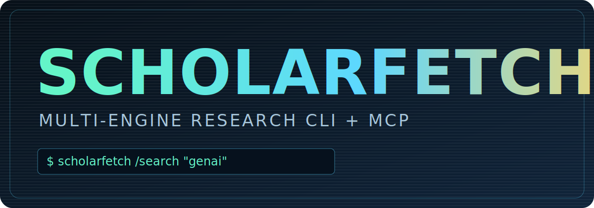

# ScholarFetch



ScholarFetch is a multi-engine academic research environment for:
- terminal-first literature exploration
- MCP-powered agent workflows
- building curated reading lists and exportable research corpora

It combines:
- a rich interactive CLI for humans
- a classic MCP server (stdio)
- a FastMCP server (`stdio`, `sse`, `streamable-http`)

The core idea is simple: start from keywords, DOI, or authors, traverse papers and references, inspect abstracts and full text, save what matters, then export a compact corpus for synthesis.

## What ScholarFetch Does
- Searches across multiple scholarly engines in parallel
- Resolves ambiguous author identities and expands author paper lists
- Traverses references as first-class research nodes
- Retrieves abstracts and machine-readable full text when available
- Tracks a saved paper set during an interactive research session
- Exports citations, abstracts, BibTeX, or full-text corpora
- Exposes the same research workflow to MCP agents
- Maintains stateful saved-paper collections inside one MCP session

## Engines
- Elsevier (Scopus / Abstract / Article retrieval)
- OpenAlex
- Crossref
- arXiv
- Europe PMC
- Springer Nature (metadata + open access)
- Semantic Scholar (DOI enrichment path)

## Installation
```bash
git clone https://github.com/laibniz/scholarfetch.git
cd scholarfetch
python3 -m venv .venv
source .venv/bin/activate
pip install -e .
scholarfetch
```

Console scripts:
- `scholarfetch`
- `scholarfetch-mcp`
- `scholarfetch-fastmcp`

Alternative:
```bash
python3 scholarfetch.py
```

## Credentials
ScholarFetch loads provider credentials server-side / client-side from environment.

Default env file:
- `.scholarfetch.env`

Typical variables:
```bash
ELSEVIER_API_KEY=...
ELSEVIER_INSTTOKEN=...
SPRINGER_META_API_KEY=...
SPRINGER_OPENACCESS_API_KEY=...
```

Notes:
- `ELSEVIER_INSTTOKEN` is optional
- provider entitlements and rate limits still apply
- MCP tools do not accept API keys in tool arguments

## CLI Research Workflow
ScholarFetch CLI is designed for research traversal.

Typical flow:
1. Start from a topic, DOI, or author.
2. Inspect papers.
3. Read abstracts or full text.
4. Expand references.
5. Jump to related authors.
6. Save promising papers.
7. Export a corpus for downstream work.

Example:
```text
/search graph neural networks
/author Albert Einstein
/papers 1 has:abstract
/article 1
/refs 1
/saved
/export fulltext dummy corpus.txt
```

## CLI Features
- Interactive picker with tree navigation
- Breadcrumbs for current research position
- Action bar for `OPEN`, `ABSTRACT`, `TEXT`, `REFS`, and `AUTHOR`
- `Backspace` to go to parent node
- `Esc` to return to prompt
- `S` to save a paper from paper lists or reference lists
- `X` to remove from the saved list
- `AUTHOR` action from a paper now lets you select:
  - a single author
  - `ALL AUTHORS`
- Reference lists behave like paper lists:
  - `open`
  - `abstract`
  - `text`
  - `refs`
  - `author`
- Automatic paper availability hints:
  - abstract availability
  - full-text availability
- Progress feedback for expensive transitions
- Interruptible reference preview building with partial results kept

## Core CLI Commands
- `/search <keywords|doi|person name>`
- `/author <name>`
- `/papers <author name|index> [filters]`
- `/doi <doi>`
- `/open <index>`
- `/abstract <doi|index>`
- `/article <doi|index>`
- `/refs <doi|index>`
- `/ref <index>`
- `/saved`
- `/export [format style path ...]`
- `/import [path]`
- `/pick [mode]`
- `/config`
- `/engines`
- `/help`

## Paper Filters
Use with `/papers`:
- `year>=YYYY`, `year<=YYYY`, `year=YYYY`
- `has:abstract`, `has:doi`, `has:pdf`, `has:fulltext`
- `venue:<text>`, `title:<text>`, `doi:<text>`

Examples:
```text
/papers 1 year>=2020 has:abstract
/papers 1 has:fulltext
/papers andrea de mauro venue:marketing
```

## Export Modes
ScholarFetch supports four export modes from the saved paper set.

- `bib`
  - BibTeX for citation managers and bibliographic tooling
- `citations`
  - citation-only export in `harvard`, `apa`, or `ieee`
- `abstracts`
  - metadata + abstract for each saved paper
- `fulltext`
  - metadata + abstract + full text when available
  - optional inclusion of references

This makes ScholarFetch useful as a corpus builder for downstream synthesis agents.

## MCP Server
ScholarFetch exposes the same research model through MCP.

Modes:
- Classic MCP (stdio): `python3 scholarfetch_mcp.py`
- FastMCP stdio: `python3 scholarfetch_fastmcp.py --transport stdio`
- FastMCP SSE: `python3 scholarfetch_fastmcp.py --transport sse --host 127.0.0.1 --port 8000`
- FastMCP streamable HTTP: `python3 scholarfetch_fastmcp.py --transport streamable-http --host 127.0.0.1 --port 8000 --http-path /mcp`

Validation:
```bash
python3 scholarfetch_mcp.py --self-test
python3 scholarfetch_fastmcp.py --self-test
```

Public demo endpoints:
- Web UI: https://huggingface.co/spaces/Laibniz/ScholarFetch_Web
- Public MCP endpoint: https://laibniz-scholarfetch-web.hf.space/mcp/
- MCP Registry listing: `io.github.laibniz/scholarfetch`

## MCP Research Model
The MCP server is designed for agent workflows, not only one-off calls.

An agent can:
1. Search papers
2. Resolve authors
3. Expand to author papers
4. Read abstracts / full text
5. Expand references
6. Save promising papers into a named in-memory reading list
7. Export the reading list as:
   - citations
   - abstracts
   - BibTeX
   - full-text corpus

This lets an agent build a focused research set inside one MCP session and then hand off an export artifact to another synthesis step.

See [MCP_SERVER.md](./MCP_SERVER.md) for the detailed tool model.

## Repository Files
- `scholarfetch.py`: CLI entrypoint
- `scholarfetch_cli.py`: core CLI + retrieval logic
- `scholarfetch_mcp.py`: classic MCP server
- `scholarfetch_fastmcp.py`: FastMCP server
- `MCP_SERVER.md`: MCP usage guide
- `AGENTS.md`: agent-facing workflow guide
- `SKILL.md`: structured research skill guide
- `SKILLS.md`: index for agent-facing skill docs
- `CONTRIBUTING.md`: contributor notes

## For Agents
If you are running ScholarFetch from an MCP-compatible system, read:
- [AGENTS.md](./AGENTS.md)
- [SKILL.md](./SKILL.md)
- [SKILLS.md](./SKILLS.md)

These documents explain how to use ScholarFetch as a literature-research environment rather than as a flat search API.

## Contributing
See [CONTRIBUTING.md](./CONTRIBUTING.md).

## Security
See [SECURITY.md](./SECURITY.md).

## License
MIT License. See [LICENSE](./LICENSE).
